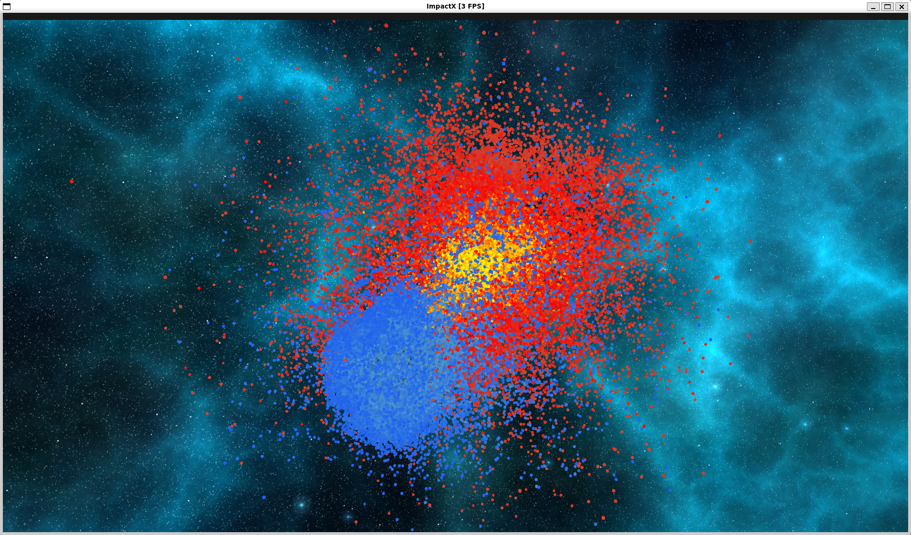

# ImpactX
This repository provides a simple simulation of planetary collisions using OpenGL. For collisions, only gravity and elastic collision are considered. Please make sure that cuda is installed when you run the simulation, because it uses cuda for speed-up.


<br></br>

# Elastic collision
When particles collide with each other, it is necessary to calculate the velocity after the collision according to the idea of elastic collision. Comprehensive information about elastic collision can be found [here](https://en.wikipedia.org/wiki/Elastic_collision#CITEREFSerwayJewett2014).

Consider particles A and B with masses $m_A$, $m_B$, and velocities $v_{A1}$, $v_{B1}$ before collision, $v_{A2}$, $v_{B2}$ after collision. The conservation of momentum before and after the collision is expressed by:

$$
m_A v_{A1} + m_B v_{B1} = m_A v_{A2} + m_B v_{B2} \qquad(1)
$$

Likewise, the conservation of the total kenetic energey is expressed by:

$$
\frac{1}{2} m_A v_{A1}^2 + \frac{1}{2} m_B v_{B1}^2 = \frac{1}{2} m_A v_{A2}^2 + \frac{1}{2} m_A v_{B2}^2 \qquad(2)
$$

These equations may be solved directly to find $v_{A2}$, $v_{B2}$ when $v_{A1}$, $v_{B1}$ are known.

$$
\begin{align*}
v_{A2} &= \frac{m_A - m_B}{m_A + m_B} v_{A1} + \frac{2m_B}{m_A + m_B} v_{B1} \\
v_{B2} &= \frac{2m_A}{m_A + m_B} v_{A1} + \frac{m_B - m_A}{m_A + m_B} v_{B1} \qquad(3)
\end{align*}
$$

In this case, we need to think about 3D collision with two moving particles.

In an angle-free representation, the changed velocities are computed using the center $x_1$ and $x_2$ at the time of contact as

$$
\begin{align*}
v_1 \prime &= v_1 - \frac{2m_2}{m_1 + m_2} \frac{\langle v_1 - v_2, x_1 - x_2 \rangle}{\parallel x_1 - x_2 \parallel^2} (x_1 - x_2), \\
v_2 \prime &= v_2 - \frac{2m_1}{m_1 + m_2} \frac{\langle v_2 - v_1, x_2 - x_1 \rangle}{\parallel x_2 - x_1 \parallel^2} (x_2 - x_1) \qquad(4)
\end{align*}
$$

where the angle brackets indicate the inner product of two vectors.

For collisions of two or more dimentions, the angle of collision must also be considered: if the vector between the centers of the particles is taken as the axis of collision and the projection vector of the velocity vector on that axis, we can use Eq(3) in one dimention.


Although not an angle free method, [this article](https://williamecraver.wixsite.com/elastic-equations) is an easy way to understand how to think of the collision as one dimensional, with the vector between the two particles as the axis.

<br></br>

# Velocity update
If the particles are less than or equal to the sum of each other's radius, they are cosidered to be in collision and a post-collision calculation is performed with elastic collision. If not, the gravity with other particles is calculated by the following formula.

$$
F=G\frac{Mm}{r^2}
$$

For acceleration, cuda is used to calculate collisions and gravity.

```c++
__global__ void update_particle_kernel(glm::vec3 *cu_position, glm::vec3 *cu_velocity, const float mass,
    const float delta_time, const int num_particles, const float collision_distance) {
    int i = blockIdx.x * blockDim.x + threadIdx.x;
    if (i >= num_particles) {
        return;
    }

    glm::vec3 all_accel(0.0f);
    for (int j = 0; j < num_particles; j++) {
        if (i == j) {
            continue;
        }
        float dist = glm::distance(cu_position[i], cu_position[j]);
        if (dist <= collision_distance) {
            // Calculate collision
            cu_velocity[i] = cu_velocity[i] - (glm::dot(
                cu_velocity[i] - cu_velocity[j], cu_position[i] - cu_position[j]) / (dist * dist))
                * (cu_position[i] - cu_position[j]);
        } else {
            // Calculate gravity
            float G = 6.67430e-11;
            float accel_power = G * (mass * mass) / (dist * dist);
            glm::vec3 accel = (cu_position[j] - cu_position[i]) / dist * accel_power;
            all_accel += accel;
        }
    }
    cu_velocity[i] += all_accel * delta_time;
    cu_position[i] += cu_velocity[i] * delta_time;
}
```

However, this process's time complexity is $O(n^2)$, so it is difficult to simulate with a million particles, etc. Although not implemented this time, it is necessary to speed up the simulation by using [Barnes-Hut Algorithm](http://arborjs.org/docs/barnes-hut), etc

<br></br>

# How to run
The tested environment is as follows. With NVIDIA GeForce RTX 4060, it was about 4 fps for 10k particles.

```
- OS -> Ubuntu
- OpenGL -> 4.0
- Cuda -> 11.8
```

First, you should intall glfw on your environemt by running following command.

```bash
bash setup.sh
```

After that, you can compile and run the program with following commands.

```bash
cd srcs
make
./ImpactX
```

**Before implact**


**After implact**



<br></br>

# References
- [Elastic collision](https://en.wikipedia.org/wiki/Elastic_collision#CITEREFSerwayJewett2014)
- [Elastic Collisions](https://williamecraver.wixsite.com/elastic-equations)
- [The Barnes-Hut Algorithm](http://arborjs.org/docs/barnes-hut)
